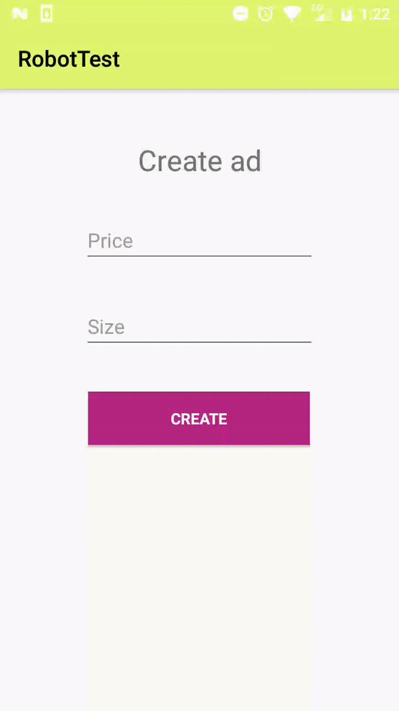
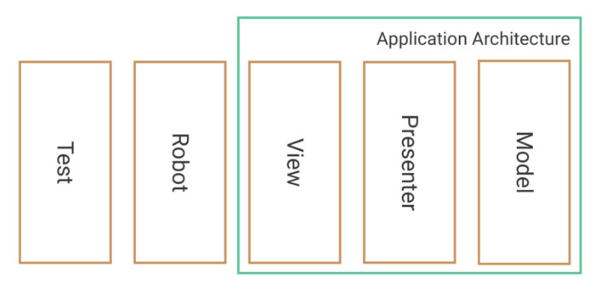

# RobotTest [](https://opensource.org/licenses/MIT)
This repo works on robot pattern in android UI testing with [espresso](https://developer.android.com/training/testing/espresso) and [kotlin](https://kotlinlang.org/docs/reference/) DSL

## Things learned
- android app development
- UI testing
- Espresso
- kotlin DSL

app consists of a simple activity containing two edit texts, one for setting price other for size and a create button. If both text fields are filled a success label will appear,
 in case of any error, an error label will appear.



This UI testing strategy consists of applying robot pattern to wrap related espresso UI interactions outside test behavior. This pattern separates the **what** of the **how**. Gives you the power of defining a test to make without taking care
of UI details, which will be encapsulated in the robot.




This way you can write the behavior of the test like this:

``` kotlin
@Test
fun setPriceAndSizeCreateIsSuccess() {
    ad {
        price(750f)
        size(250f)
    } create {
        isSuccess()
    }
}
```

You can use DSL power thanks to some of these kotlin features:
- Use of lambdas outside of method parentheses
- Lambdas with receivers
- Extension functions
- infix operator


``` kotlin
fun ad(func: CreateAdRobot.() -> Unit) = CreateAdRobot().apply { func() }

infix fun create(func: CreateAdRobot.() -> Unit): CreateAdRobot {
    onView(withId(R.id.createButton)).perform(click())
    return CreateAdRobot().apply { func() }
}
```


## License

    MIT License

    Copyright (c) 2019 vicfran

    Permission is hereby granted, free of charge, to any person obtaining a copy
    of this software and associated documentation files (the "Software"), to deal
    in the Software without restriction, including without limitation the rights
    to use, copy, modify, merge, publish, distribute, sublicense, and/or sell
    copies of the Software, and to permit persons to whom the Software is
    furnished to do so, subject to the following conditions:

    The above copyright notice and this permission notice shall be included in all
    copies or substantial portions of the Software.

    THE SOFTWARE IS PROVIDED "AS IS", WITHOUT WARRANTY OF ANY KIND, EXPRESS OR
    IMPLIED, INCLUDING BUT NOT LIMITED TO THE WARRANTIES OF MERCHANTABILITY,
    FITNESS FOR A PARTICULAR PURPOSE AND NONINFRINGEMENT. IN NO EVENT SHALL THE
    AUTHORS OR COPYRIGHT HOLDERS BE LIABLE FOR ANY CLAIM, DAMAGES OR OTHER
    LIABILITY, WHETHER IN AN ACTION OF CONTRACT, TORT OR OTHERWISE, ARISING FROM,
    OUT OF OR IN CONNECTION WITH THE SOFTWARE OR THE USE OR OTHER DEALINGS IN THE
    SOFTWARE.